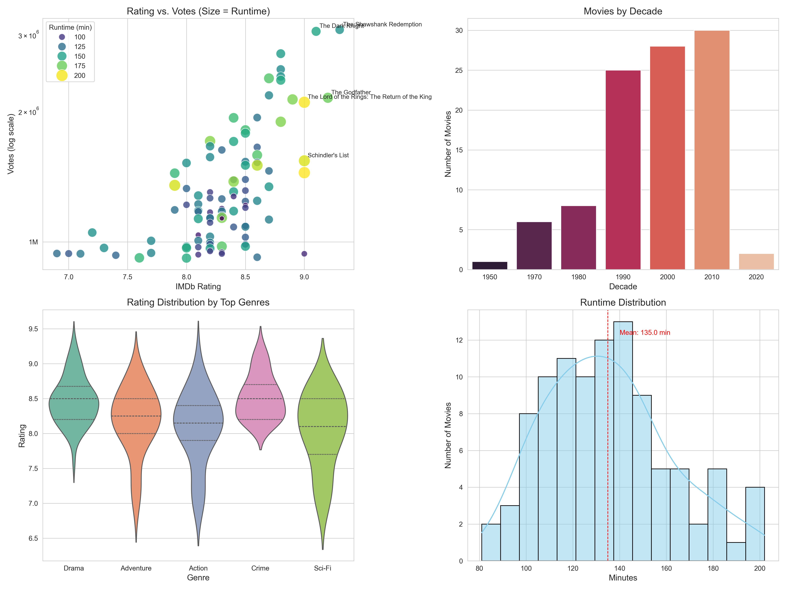

# IMDb Top 100 Movies Analysis

## Overview
This Python project analyzes IMDb's top 100 most popular movies by number of votes. It retrieves official IMDb datasets through web scraping, processes and cleans the data, performs exploratory analysis, and generates insightful visualizations. The analysis includes genre-based rankings, temporal trends, and relationships between movie ratings, popularity, and runtime.

## Key Features
- **Data Acquisition**: Automatically downloads and processes IMDb's official datasets
- **Data Cleaning**: Handles missing values and converts data types
- **Statistical Analysis**: Calculates average ratings, runtimes, and total votes
- **Visualizations**: Creates professional-quality charts using Seaborn/Matplotlib
- **Genre Analysis**: Identifies top movies in each genre by rating and popularity
- **Temporal Analysis**: Examines movie distribution by decade
- **Output Generation**: Produces CSV files, visualizations, and terminal reports

## Sample Outputs

### Terminal Insights
```
===== Data Insights =====
Total movies analyzed: 100
Average rating: 8.3
Average runtime: 126.5 minutes
Total votes: 453,826,812

Oldest movie: 1921 (The Kid)
Newest movie: 2023 (Oppenheimer)

Top 3 Genres:
- Drama: 75 movies
- Action: 32 movies
- Adventure: 31 movies
```

### Top Movies by Genre
```
Top 3 'Drama' Movies by Rating:
                     Title  Rating  Year
     The Shawshank Redemption     9.3  1994
              The Godfather     9.2  1972
                12 Angry Men     9.0  1957

Top 3 'Drama' Movies by Popularity (Votes):
                     Title     Votes  Year
           The Dark Knight   2738130  2008
     The Shawshank Redemption   2836049  1994
              The Godfather   1934527  1972
```

### Visualization Preview


The composite visualization includes:
1. Rating vs. Votes scatter plot with runtime sizing
2. Movies by decade bar chart
3. Rating distribution by genre violin plots
4. Runtime distribution histogram

## File Descriptions
- `IMDb_EDA.py`: Main analysis script
- `top_100_imdb_movies.csv`: Output dataset of top 100 movies
- `movie_analysis.png`: Composite visualization of insights

## Customization
Modify these aspects for different analyses:
1. Change `head(100)` to `head(250)` in `get_top_100_movies()` for top 250 movies
2. Adjust visualization styles in `create_visualizations()`
3. Modify genre count in `top_movies_by_genre()` for more/less genres

---
**Note**: IMDb datasets are updated daily. For the most current analysis, run the script regularly. This project is not affiliated with IMDb.